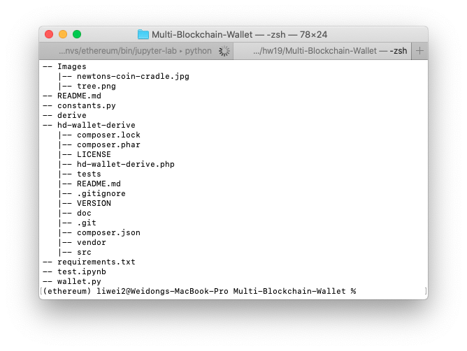
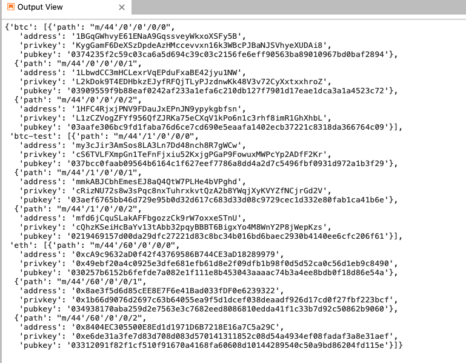
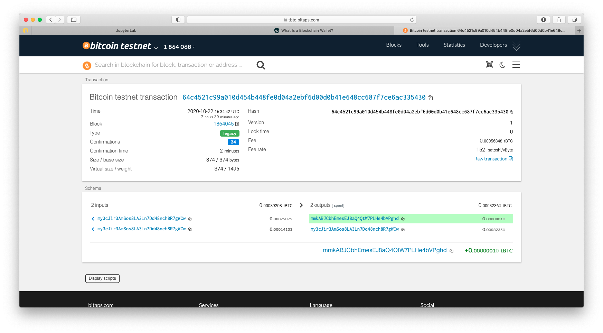
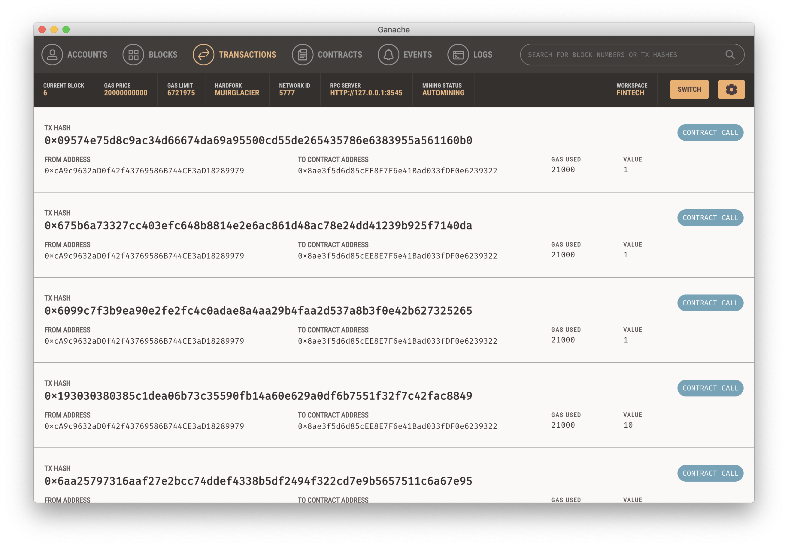
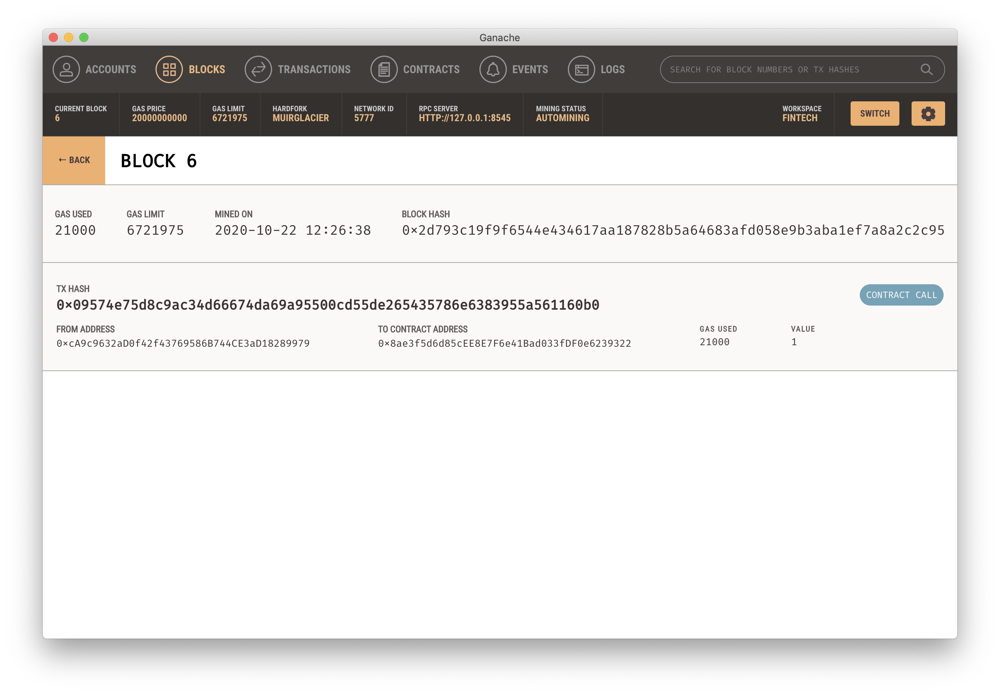

# Multi-Blockchain-Wallet


Building a portfolio management system that supports not only traditional assets like gold, silver, stocks, etc, but crypto-assets as well.

A command line tool, `hd-wallet-derive` that supports not only BIP32, BIP39, and BIP44, but also supports non-standard derivation paths for the most popular wallets out there today. However, we need to integrate
the script into the backend with Python.

Once integrated this "universal" wallet, we can begin to manage billions of addresses across 300+ coins, having a serious edge against the competition.

### What is a digital Blockchain wallet

A digital, or blockchain, wallet is simply an asymmetric keypair that act as "keys" to your funds that are on the blockchain. It also serves as a place where you can view and send transactions.

Much like a debit card does not hold your actual money, but the access to it, a blockchain wallet holds the access to your funds but not the actual funds. The actual funds live on the blockchain.

Blockchain Wallet is provided by Blockchain, a software company founded by Peter Smith and Nicolas Cary.

Blockchain Wallet users can manage their balances of two cryptocurrencies: bitcoin and ether.

Blockchain Wallet charges dynamic fees, meaning that the transaction fees can be different based on factors such as transaction size.

For more reading on blockchain wallets, check out these articles from [investopedia](https://www.investopedia.com/terms/b/blockchain-wallet.asp) and [uncoin](https://blog.unocoin.com/what-happens-if-you-forget-your-bitcoin-wallet-keys-bbf563ce281a).

### Dependencies

- PHP must be installed on your operating system (any version, 5 or 7). 

- Clone the [`hd-wallet-derive`](https://github.com/dan-da/hd-wallet-derive) tool.

- [`bit`](https://ofek.github.io/bit/) Python Bitcoin library.

- [`web3.py`](https://github.com/ethereum/web3.py) Python Ethereum library.

### Project setup

- Create a project directory called `wallet` and `cd` into it.

- Clone the `hd-wallet-derive` tool into this folder and install it using the instructions on its `README.md`.

- Create a symlink called `derive` for the `hd-wallet-derive/hd-wallet-derive.php` script into the top level project
  directory like so: `ln -s hd-wallet-derive/hd-wallet-derive.php derive`

  This will clean up the command needed to run the script in our code, as we can call `./derive`
  instead of `./hd-wallet-derive/hd-wallet-derive.php`.

- Test that you can run the `./derive` script properly, use one of the examples on the repo's `README.md`

- Create a file called `wallet.py` -- this will be your universal wallet script. 

Your directory tree should look something like this:



### Setup constants

- In a separate file, `constants.py`, set the following constants:
  - `BTC = 'btc'`
  - `ETH = 'eth'`
  - `BTCTEST = 'btc-test'`

- In `wallet.py`, import all constants: `from constants import *`

- Use these anytime to reference these strings, both in function calls, and in setting object keys.

### Generate a Mnemonic

- Generate a new 12 word mnemonic using `hd-wallet-derive` or by using [this tool](https://iancoleman.io/bip39/).

- Set this mnemonic as an environment variable, and include using:
  `mnemonic = os.getenv('MNEMONIC')`
  
### Deriving the wallet keys

- Use the `subprocess` library to call the `./derive` script from Python. Make sure to properly wait for the process.

- The following flags must be passed into the shell command as variables:
  - Mnemonic (`--mnemonic`) must be set from an environment variable, or default to a test mnemonic
  - Coin (`--coin`)
  - Numderive (`--numderive`) to set number of child keys generated

- Set the `--format=json` flag, then parse the output into a JSON object using `json.loads(output)`

- Wrap all of this into one function, called `derive_wallets`

- Create an object called `coins` that derives `ETH` and `BTCTEST` wallets with this function.
  When done properly, the final object should look something like this (there are only 3 children each in this image):



### Linking the transaction signing libraries

Using the three more functions:

- `priv_key_to_account` -- this will convert the `privkey` string in a child key to an account object
  that `bit` or `web3.py` can use to transact.
  This function needs the following parameters:

  - `coin` -- the coin type (defined in `constants.py`).
  - `priv_key` -- the `privkey` string will be passed through here.

- `create_tx` -- this will create the raw, unsigned transaction that contains all metadata needed to transact.
  This function needs the following parameters:

  - `coin` -- the coin type (defined in `constants.py`).
  - `account` -- the account object from `priv_key_to_account`.
  - `to` -- the recipient address.
  - `amount` -- the amount of the coin to send.

- `send_tx` -- this will call `create_tx`, sign the transaction, then send it to the designated network.
  This function needs the following parameters:

  - `coin` -- the coin type (defined in `constants.py`).
  - `account` -- the account object from `priv_key_to_account`.
  - `to` -- the recipient address.
  - `amount` -- the amount of the coin to send.

  You may notice these are the exact same parameters as `create_tx`. `send_tx` will call `create_tx`, so it needs
  all of this information available.

  You will need to check the coin, then create a `raw_tx` object by calling `create_tx`. Then, you will need to sign
  the `raw_tx` using `bit` or `web3.py` (hint: the account objects have a sign transaction function within).

  Once you've signed the transaction, you will need to send it to the designated blockchain network.

#### Bitcoin Testnet transaction

- Fund a `BTCTEST` address using [this testnet faucet](https://testnet-faucet.mempool.co/).

- Use a [block explorer](https://tbtc.bitaps.com/) to watch transactions on the address.

- Send a transaction to another testnet address (either one of your own, or the faucet's).

```
coins = {}

coin = BTCTEST
coins[coin] = derive_wallets(mnemonic, coin)

priv_key = coins[coin][0]['privkey']
account = priv_key_to_account(coin, priv_key)

recipient = coins[coin][1]['address']
amount = 0.0000001
tx_created = create_tx(coin, account, recipient, amount)
send_tx(coin, account, recipient, amount)

```

- Screenshot the confirmation of the transaction like so:



#### Local Ganache Ethereum transaction

- Launch Gadache and create a Workspace and navigate through the various configuration pages, e.g.:

...

  * SERVER
    * HOSTNAME = `127.0.0.1`
    * PORT NUMBER = `8545`
    
...

- Send a transaction to another testnet address (either one of your own, or others).


```
coins = {}

coin = ETH
coins[coin] = derive_wallets(mnemonic, coin)

priv_key = coins[coin][0]['privkey']
account = priv_key_to_account(coin, priv_key)

recipient = coins[coin][1]['address']
amount = 1
tx_created = create_tx(coin, account, recipient, amount)
send_tx(coin, account, recipient, amount)

```

- Screenshots the confirmation of the transaction like so:



